# GARCH-Volatility-Estimation

This project implements GARCH(1,1) model to estimate volatility for TCS, Infosys, Asian Paints, and Bajaj over various timeframes. Alongside volatility estimations, a rolling window protocol was implented with the window size equal to 1 trading year to compare the actual vs forecasted volatility over the window. Finally, we used the estimated volatility to forecast future volatility over the time-horizon of 2 weeks i.e 14 days. The analysis was conducted using the GARCH.ipynb notebook.
## Data
The data used in this project was sourced from Yahoo Finance and includes the stock prices for the following companies:
- TCS (Tata Consultancy Services)
- Infosys
- Asian Paints
- Bajaj Finance

The data is stored in the `data` folder as CSV files, with each file containing the stock prices for a specific company.
The data includes the following columns:

- `Date`: The date of the stock price
- `Close`: The closing price of the stock
## GARCH Model
The Generalized Autoregressive Conditional Heteroskedasticity (GARCH) model is a time series model used to estimate the volatility of financial returns. It is an extension of the ARCH model that allows for the conditional variance to be modeled as a function of past variances and past squared errors. The GARCH(1,1) model is given by the following equations:

$$
\begin{align}
Y_t &= \sigma_t \epsilon_t \\
\sigma_t^2 &= \omega + \alpha Y_{t-1}^2 + \beta \sigma_{t-1}^2
\end{align}
$$

where:
- $Y_t$ is the return at time $t$
- $\sigma_t^2$ is the conditional variance at time $t$
- $\epsilon_t$ is the standardized error term at time $t$
- $\omega$, $\alpha$, and $\beta$ are the parameters of the model

The GARCH model is used to estimate the conditional variance of the returns, which can then be used to calculate the volatility of the returns.
## Methodology
The analysis was conducted in the following steps:
1. **Data Preprocessing:** The stock prices were used to calculate the log returns, which were then used to estimate the GARCH model parameters.
2. **Model Estimation:** The GARCH(1,1) model was estimated using the `arch` library in Python, and the volatility was calculated for different time periods (3 months, 6 months, 9 months, and full period).
3. **Volatility Forecasting:** The estimated GARCH model was used to forecast the future volatility over a 2-week horizon (14 days) for each company.
4. **Rolling Window Analysis:** A rolling window protocol was implemented to compare the actual vs forecasted volatility over a 1-year window for each company.
## Results
The analysis provides insights into the volatility of the stock prices for each company over different time periods. The results include the raw volatility estimates, annualized volatility, and visualizations of the volatility estimates. The rolling window protocol helps evaluate the performance of the model in forecasting volatility over time. The forecasted volatility can be used to make informed decisions about future price movements.
### Volatility Analysis by Company
#### TCS
| Period | Raw Volatility | Annualized Volatility (%) |
|--------|---------------|------------------------|
| 3M     | 1.4605       | 23.18                 |
| 6M     | 1.4993       | 23.80                 |
| 9M     | 1.4859       | 23.59                 |
| Full   | 1.4170       | 22.49                 |

<div style="display: grid; grid-template-columns: repeat(2, 1fr); gap: 10px;">
    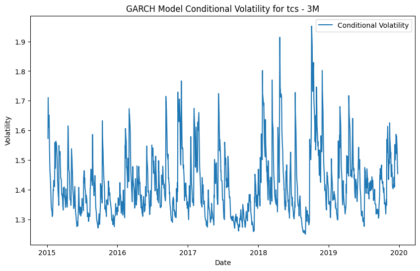
    
    
    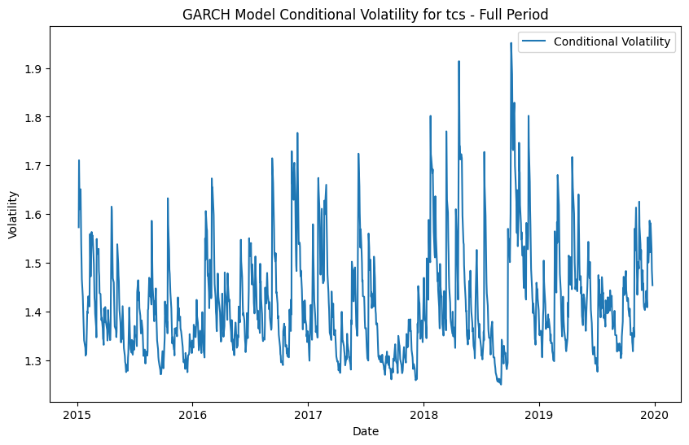
    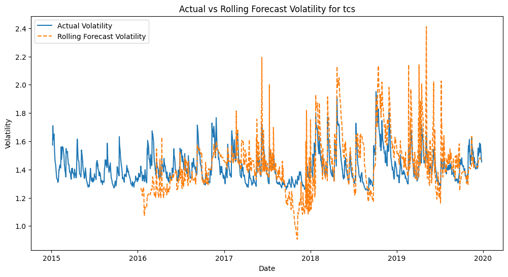
    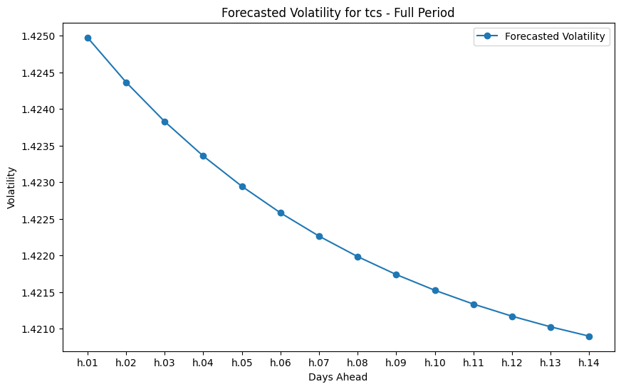
</div>

</div>

#### Infosys
| Period | Raw Volatility | Annualized Volatility (%) |
|--------|---------------|------------------------|
| 3M     | 1.6506       | 26.20                 |
| 6M     | 1.5318       | 24.32                 |
| 9M     | 1.4759       | 23.43                 |
| Full   | 1.5558       | 24.70                 |

<div style="display: grid; grid-template-columns: repeat(2, 1fr); gap: 10px;">
    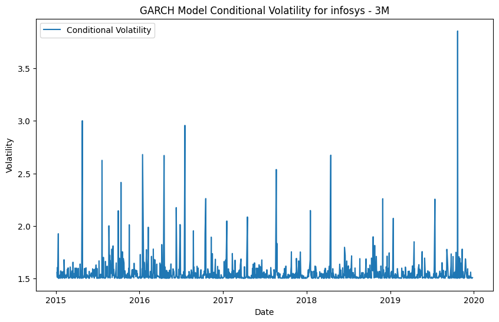
    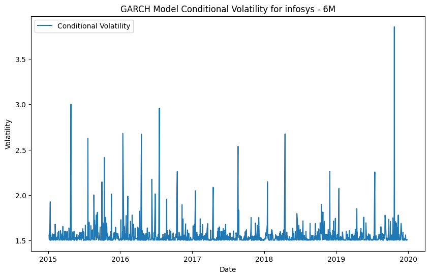
    
    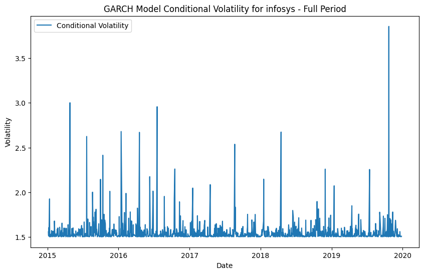
    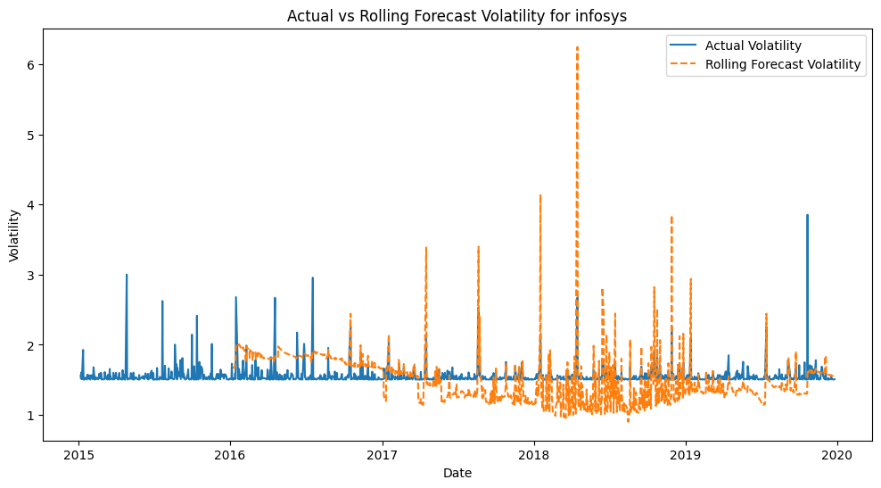
    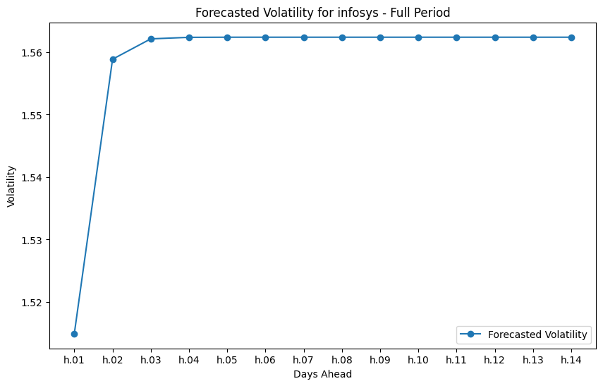
</div>

#### Bajaj
| Period | Raw Volatility | Annualized Volatility (%) |
|--------|---------------|------------------------|
| 3M     | 1.4488       | 23.00                 |
| 6M     | 1.5423       | 24.48                 |
| 9M     | 1.4769       | 23.44                 |
| Full   | 1.4782       | 23.47                 |

<div style="display: grid; grid-template-columns: repeat(2, 1fr); gap: 10px;">
    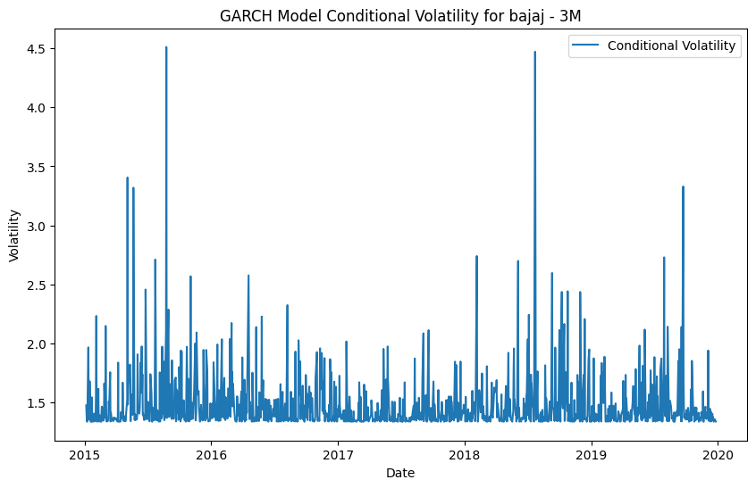
    
    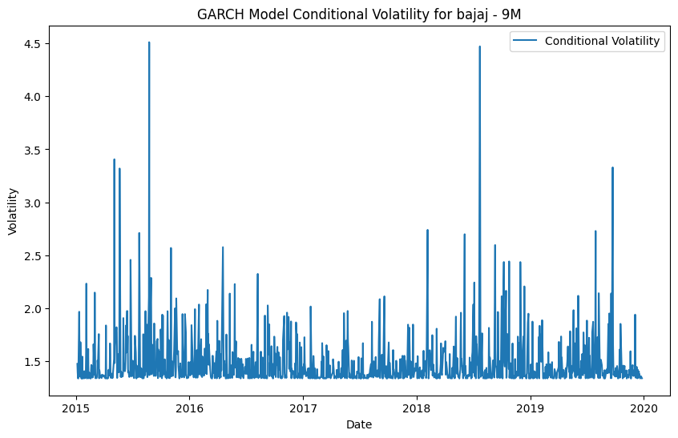
    
    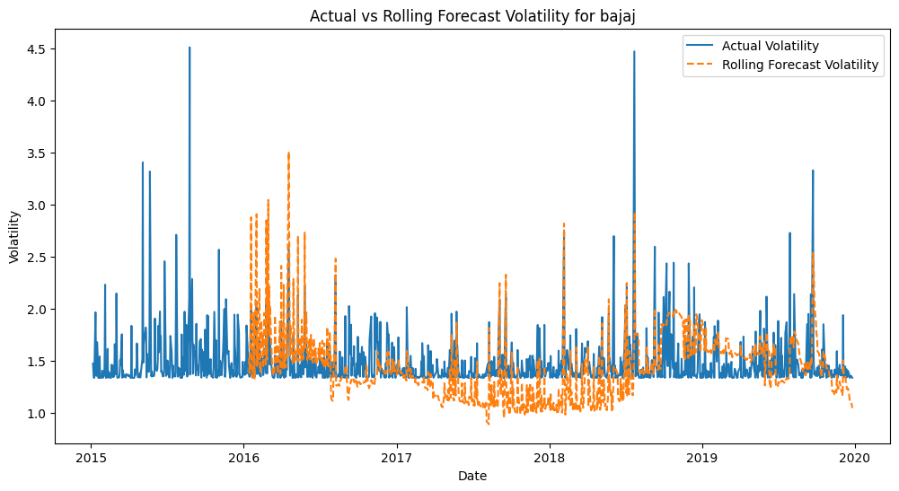
    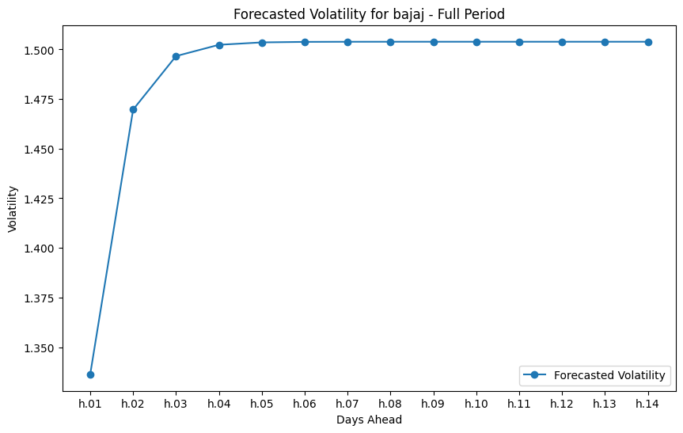
</div>

#### Asian Paints
| Period | Raw Volatility | Annualized Volatility (%) |
|--------|---------------|------------------------|
| 3M     | 1.4228       | 22.59                 |
| 6M     | 1.4446       | 22.93                 |
| 9M     | 1.3748       | 21.82                 |
| Full   | 1.4933       | 23.71                 |

<div style="display: grid; grid-template-columns: repeat(2, 1fr); gap: 10px;">
    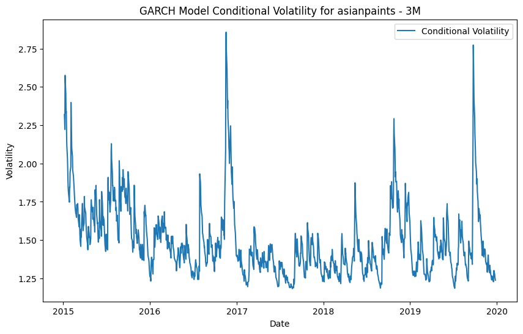
    
    
    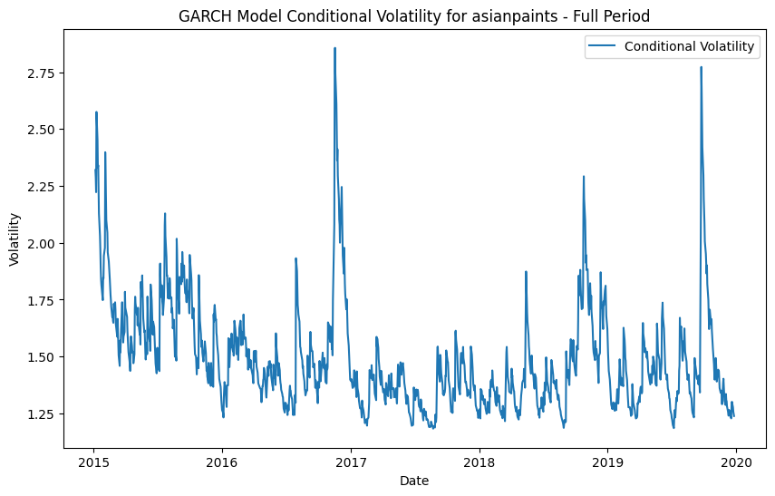
    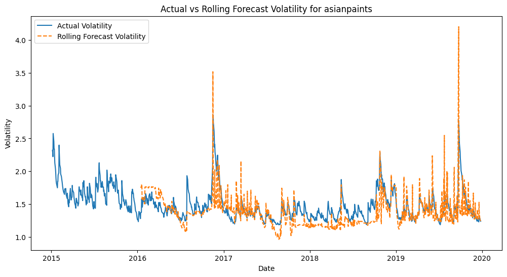
    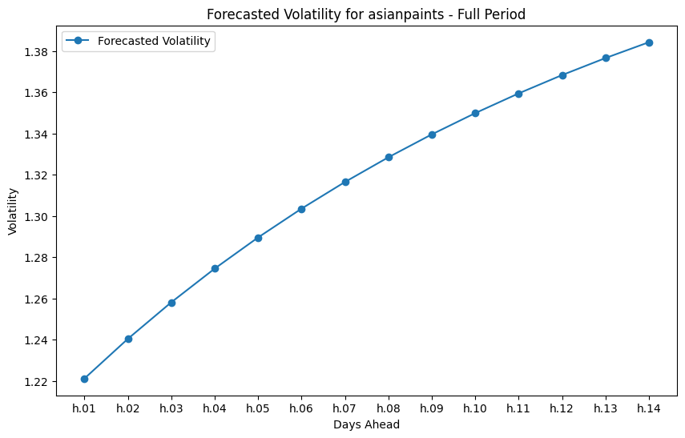
</div>
</div>

## Key Findings

The analysis reveals several interesting patterns in volatility across different time periods:

1. **Variable Time Horizon Effects:** Contrary to initial assumptions, longer time horizons don't consistently show higher volatility. For instance, TCS shows lower volatility (22.49%) in the full period compared to shorter timeframes.

2. **Company-Specific Patterns:** 
    - Infosys displays the highest volatility among all companies in the 3M period (26.20%)
    - Asian Paints shows relatively stable volatility across different periods, with a slight increase in the full period
    - Bajaj maintains consistent volatility levels across all timeframes (around 23-24%)

3. **Short-term vs Long-term Dynamics:** The 3M volatility measurements often differ significantly from full-period estimates, suggesting distinct short-term market dynamics affecting each company differently.

## How to Run the Code

1. Clone this repository
2. Install the required packages:
    ```bash
    pip install -r requirements.txt
    ```
3. Ensure the CSV files are present in the `data` folder
4. Open and run `GARCH.ipynb` using Jupyter Notebook or JupyterLab

