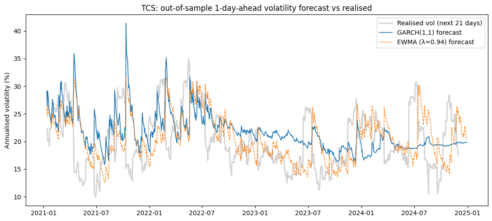
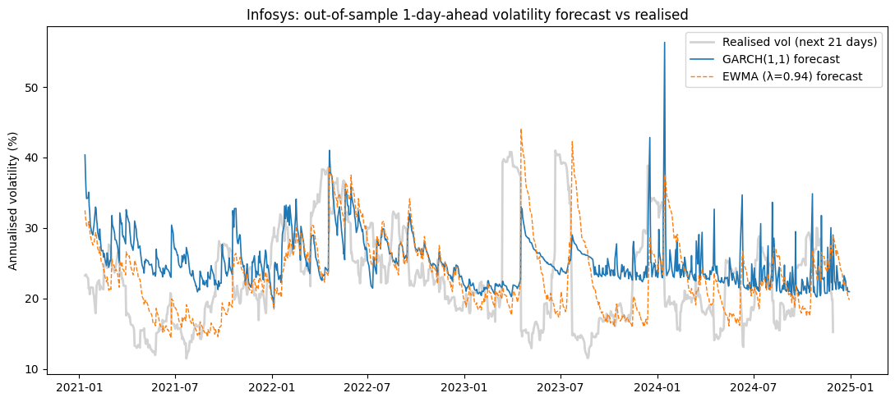
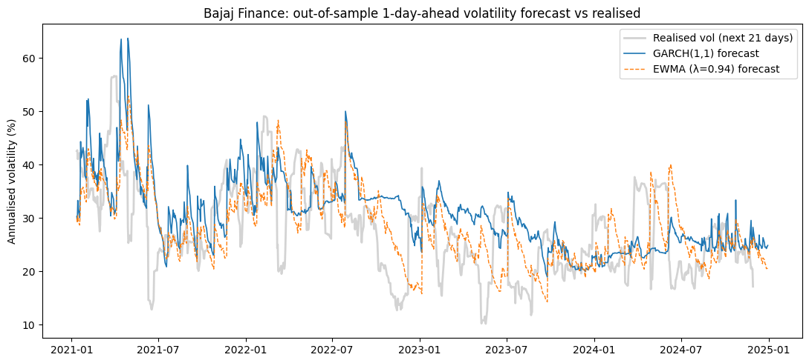
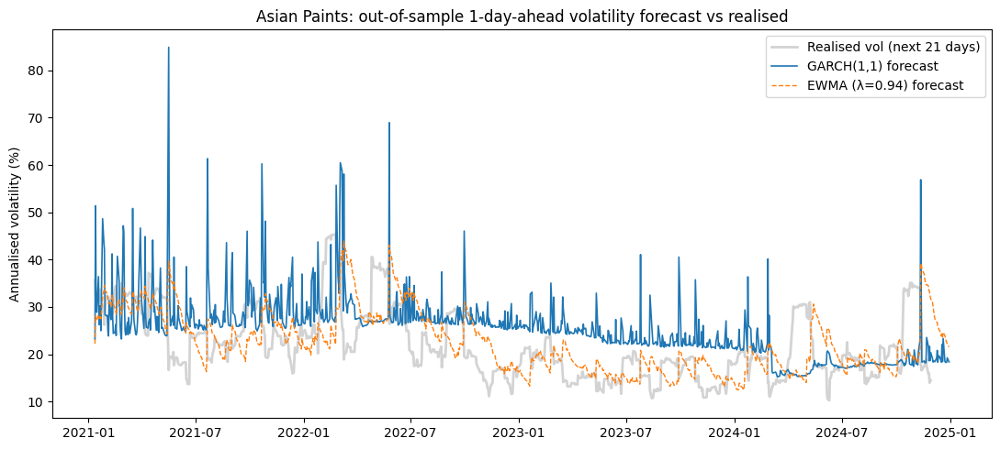
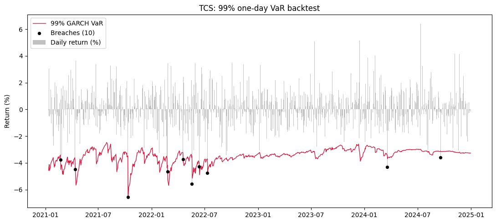
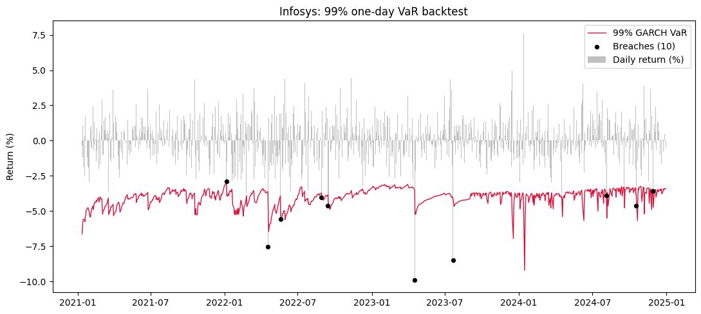
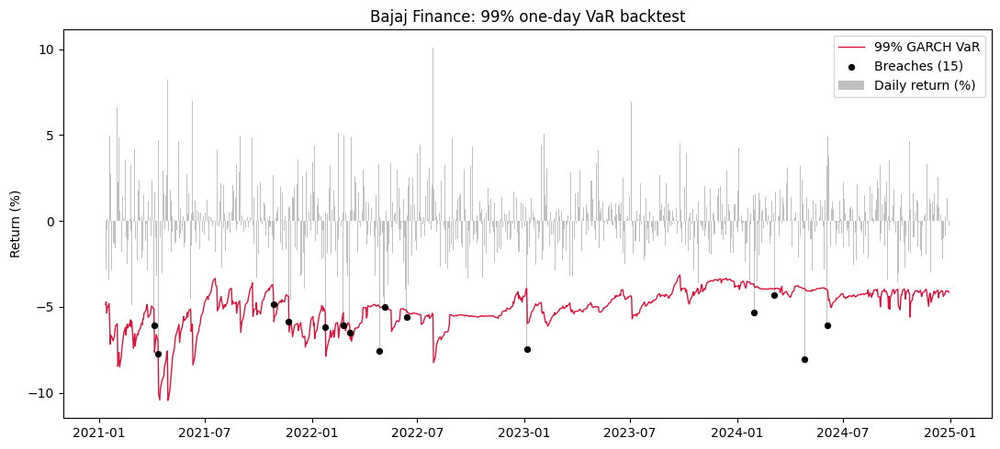
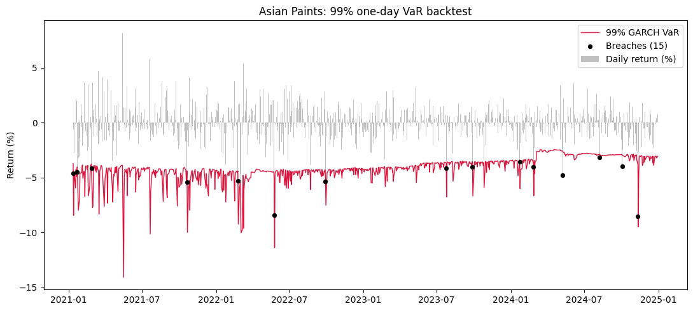

# GARCH Volatility Forecasting and VaR Backtesting: NIFTY 50 Stocks

Out-of-sample volatility forecasting and Value-at-Risk backtesting for four NIFTY 50 stocks (TCS, Infosys, Asian Paints, Bajaj Finance) using GARCH(1,1) with Student-t errors, benchmarked against EWMA (RiskMetrics) and historical volatility.

## Key Results

Out-of-sample period: roughly January 2021 to December 2024 (979 trading days per stock), with the model refitted daily on a rolling 500-day window.

**1. VaR backtesting (99%, one day).** GARCH-t passed both the Kupiec and Christoffersen tests for all 4 stocks. EWMA with normal errors passed for only 1 of 4, breaching almost twice as often as a 99% VaR should.

| Stock | GARCH-t breaches (expected 9.8) | GARCH-t breach rate | EWMA-normal breaches | EWMA-normal breach rate | GARCH-t passes | EWMA passes |
|---|---|---|---|---|---|---|
| TCS | 10 | 1.02% | 18 | 1.84% | Yes | No |
| Infosys | 10 | 1.02% | 14 | 1.43% | Yes | Yes |
| Asian Paints | 15 | 1.53% | 25 | 2.55% | Yes | No |
| Bajaj Finance | 15 | 1.53% | 20 | 2.04% | Yes | No |
| **Average** | | **1.28%** | | **1.97%** | **4 / 4** | **1 / 4** |

**2. Forecast accuracy (QLIKE loss, lower is better).** GARCH reduced forecast loss by 4.9% on average versus 21-day historical volatility, significant at 5% for 3 of 4 stocks (Diebold-Mariano). Against EWMA the average gain was 1.2%, which was **not** statistically significant for any stock.

| Stock | QLIKE gain vs 21-day hist | DM p-value | QLIKE gain vs EWMA | DM p-value |
|---|---|---|---|---|
| TCS | 5.4% | 0.004 | 2.2% | 0.051 |
| Infosys | 1.9% | 0.319 | 0.6% | 0.670 |
| Asian Paints | 6.1% | 0.038 | 0.8% | 0.687 |
| Bajaj Finance | 6.2% | 0.014 | 1.3% | 0.515 |

**Takeaway:** EWMA tracks day-to-day volatility almost as well as GARCH, which is expected because EWMA is effectively a GARCH model with persistence fixed near 1. The real advantage of GARCH-t is its **fat-tailed error distribution**: the normal distribution used by RiskMetrics understates tail losses, which is exactly what the 99% VaR backtest exposes.

## Methodology

1. **Data.** Daily prices from Yahoo Finance (January 2019 to December 2024), **adjusted for splits and bonus issues**. Log returns are scaled by 100 to help the optimiser converge. Any one-day move above 20% is flagged so that unadjusted corporate actions can be caught before modelling.
2. **Full-sample model.** GARCH(1,1) with a constant mean and Student-t errors, reporting persistence (alpha + beta), volatility half-life and long-run volatility.
3. **Rolling forecasts.** Each day's volatility is forecast using only the previous 500 trading days (about two years), with parameters refitted daily. No future data is used.
4. **Benchmarks.**
   - EWMA (RiskMetrics): sigma²(t+1) = 0.94 · sigma²(t) + 0.06 · r²(t)
   - Historical volatility: rolling 21-day standard deviation
5. **Forecast evaluation.** The next-day squared return is used as the realised variance proxy. Models are scored with MSE and QLIKE (Patton, 2011), and GARCH is compared with each benchmark using a Diebold-Mariano test with Newey-West standard errors.
6. **VaR backtesting.** One-day VaR at 99% and 95%. GARCH VaR uses the forecast mean, forecast volatility and the fitted Student-t quantile; EWMA VaR uses the normal quantile. Each model is tested with:
   - **Kupiec POF test:** is the breach rate consistent with the VaR level?
   - **Christoffersen test:** are breaches independent, or do they cluster?
7. **Volatility summary and forecast.** Average volatility over the last 3, 6 and 9 months, plus a 14-trading-day forecast path converging towards the long-run level.

## Full-Sample Parameters

| Stock | alpha | beta | alpha + beta | Half-life (days) | nu (t d.o.f.) |
|---|---|---|---|---|---|
| TCS | 0.044 | 0.919 | 0.962 | 18.1 | 4.76 |
| Infosys | 0.075 | 0.828 | 0.903 | 6.8 | 4.23 |
| Asian Paints | 0.322 | 0.184 | 0.506 | 1.0 | 3.60 |
| Bajaj Finance | 0.068 | 0.925 | 0.994 | 105.7 | 3.41 |

All four models converged. Every stock has nu below 5, confirming heavy tails and supporting the choice of Student-t over normal errors.

## Observations and Limitations

- **Asian Paints shows weak volatility clustering.** Persistence is only 0.51 and beta is not significant (p = 0.07), so a volatility shock fades in about one day. Its volatility in this period was driven by isolated large moves rather than sustained turbulent regimes. The VaR plot shows this clearly: VaR widens sharply after each large move and returns to normal the next day.
- **Bajaj Finance's long-run volatility estimate is unreliable.** With persistence at 0.994, the implied long-run volatility (57% annualised) is highly sensitive to small parameter changes and far above the realised full-sample volatility (37.7%).
- **The flagged Bajaj Finance move is genuine.** The −26.4% return on 23 March 2020 was the COVID-19 market crash, not an unadjusted corporate action (its price ratio of 0.77 does not match any split or bonus ratio).
- **95% VaR is weaker than 99%.** At 95%, GARCH-t breach rates are close to 5% for every stock (Kupiec passes for all four), but breaches cluster for Infosys and Asian Paints (Christoffersen p < 0.05). EWMA-normal passes at 95% for 3 of 4 stocks. Fat tails matter most at the extreme 99% level.
- **MSE and QLIKE disagree for two stocks.** On MSE, EWMA beats GARCH for Asian Paints and Bajaj Finance. MSE is dominated by a few extreme days, which is why QLIKE is the preferred loss for comparing volatility models.
- **Scope.** Four large-cap stocks over one period. Results may differ for other stocks, periods or asymmetric models such as GJR-GARCH or EGARCH.

## How to Run

```bash
pip install numpy pandas matplotlib scipy arch yfinance
jupyter notebook GARCH_Volatility_VaR.ipynb
```

Run all cells. With daily refitting, the rolling forecasts take a few minutes; set `REFIT_EVERY = 5` in the configuration cell for a faster run.

To use local CSV files instead of Yahoo Finance, set `USE_YFINANCE = False` and place files named `tcs.csv`, `infosys.csv`, `asianpaints.csv` and `bajaj.csv` in a `data/` folder, with a `Date` column and an `Adj Close` (or `Close`) column.

## Plots

<div>
    
    
    
    
    
    
    
    
</div>